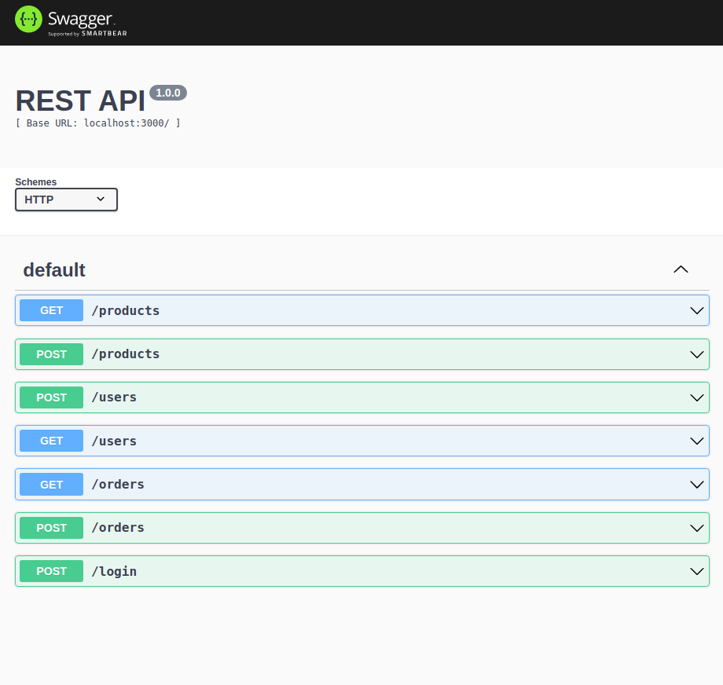

# Projeto TrybeSmith

Este foi o primeiro projeto o qual utilizamos o TypeScript!

Ficamos responsáveis por desenvolver uma API através da arquitetura MSC, utilizando o MySQL2 para conectar com o banco de dados e executar as *queries* SQL.

Para acessar a documentação, é preciso rodar a aplicação e fazer uma requisição ``GET`` com o endpoint ``/doc``.

---

# Habilidades

- Utilizar o TypeScript para desenvolver uma API;
- Tipar os principais recursos do Express;
- Validar o usuário através do JSON Web Token;
- Manipular tabelas no banco de dados, fazendo inserções, alterações e exclusões.

---

## Requisitos

Ao todo foram 8 requisitos:

#### 1. Crie um endpoint para o cadastro de produtos;

#### 2. Crie um endpoint para a listagem de produtos;

#### 3. Crie um endpoint para o cadastro de pessoas usuárias;

#### 4. Crie um endpoint para listar todos os pedidos;

#### 5. Crie um endpoint para o login de pessoas usuárias;

#### 6. Crie as validações dos produtos;

#### 7. Crie as validações para as pessoas usuárias;

#### 8. Crie um endpoint para o cadastro de um pedido.